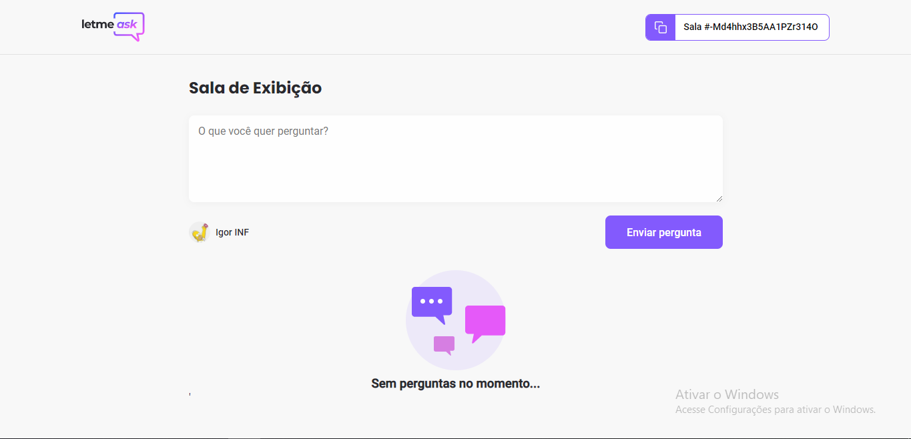

<h1 align="center">
  
</h1>
<h3 align="center">Que tal organizar perguntas e respostas do seu ambiente?</h3>

Projeto desenvolvido na NLW Together

<h4 align="center">
	🚧  Próximo nível 🚀 Pegando xp...  🚧
</h4>

<h2> 🛠 Tecnologias </h2>

Essas foram as ferramentasusadas na implementação desse projeto:

- [Node.js](https://nodejs.org/en/)
- [Firebase](https://firebase.google.com/?gclid=Cj0KCQjw_dWGBhDAARIsAMcYuJyHiqD_4zWVaKaMTMRfyv3KC59VmISt3k-Gujyz9JyBg9sPorYeQOkaAkJGEALw_wcB&gclsrc=aw.ds)
- [Styled-components](https://styled-components.com/)
- [React](https://pt-br.reactjs.org/)
- [TypeScript](https://www.typescriptlang.org/)

<h2> 🛠 Features </h2>

Alguns recursos {existentes?: boolean} no projeto:

- [Dark/Light] - 🚧  Em andamento 🚀🚧
- [Admin: marcar, selecionar e deletar perguntas]
- [Users: Likes em perguntas]
- [Autenticação com google] - 🚧 com Github.. em andamento 🚀🚧

<h2>Visão geral do projeto</h2>

- Home

- Room

- Room (Admin)

<h2>Igor Monteiro</h2>

Feito com todo foco possível...

A PRIMEIRA aplicação "complexa" que fiz de muitas que virão

